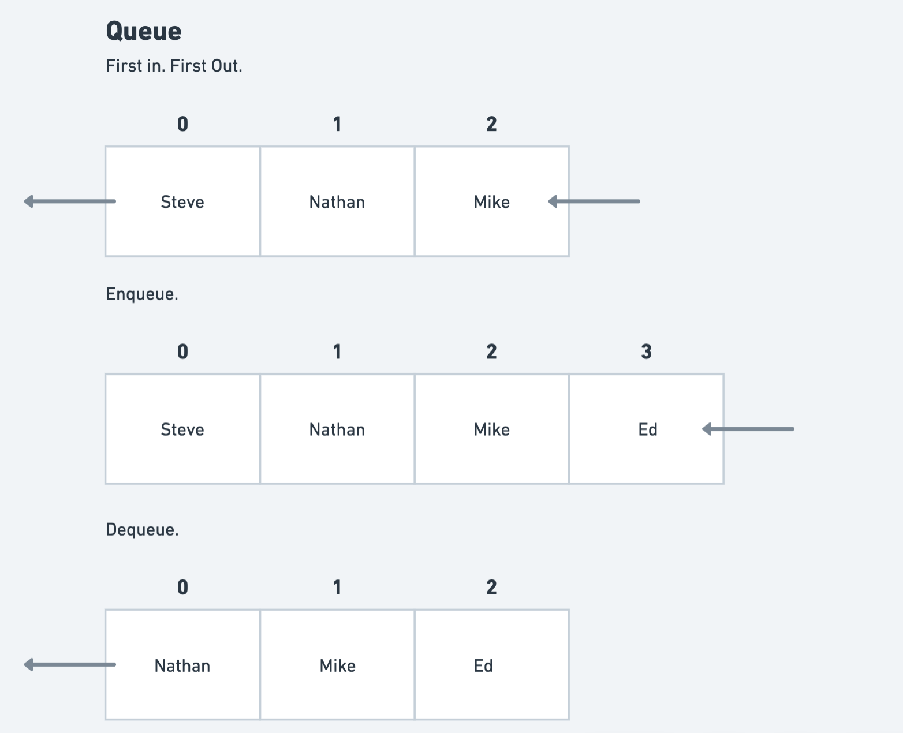
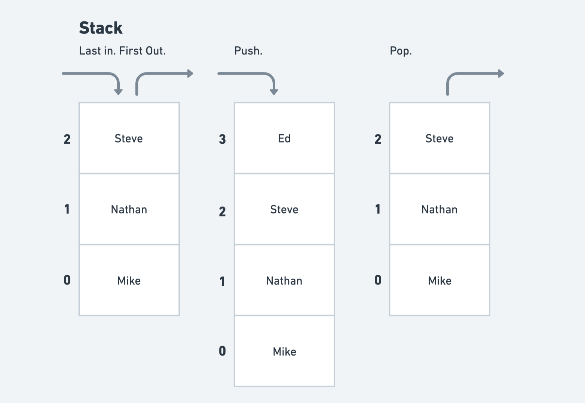
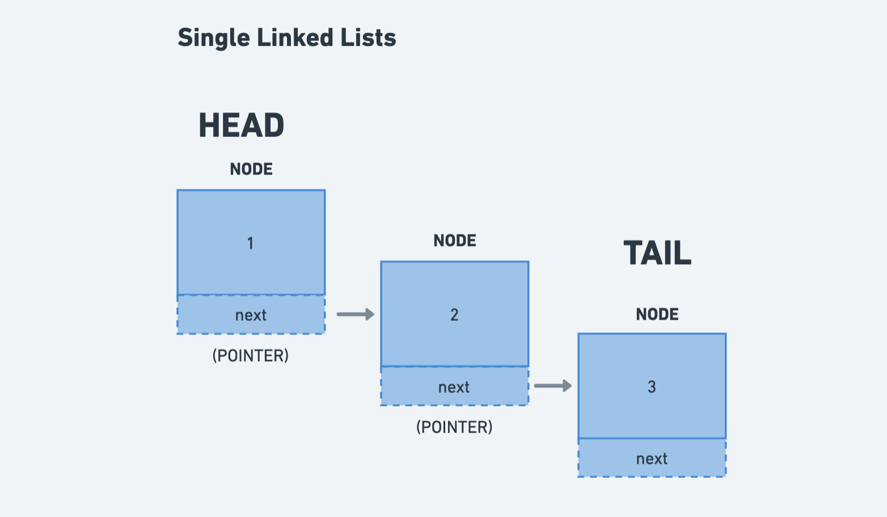

# Data Structures & Algorithms: Queues, Stacks & Linked Lists

## Instructions

There are three sections to this repo:

- Queues
- Stacks
- Linked List

Each section has a test file to guide you towards writing code for each data structure.

For the **Queue** and **Stack** section there are two parts, the first part uses an array and the second part uses a linked list.

For the **Linked List** section you have a `Node` file that you will use to create nodes for your linked lists.

## Getting Started

Fork and clone the repo.

And run the following commands to get started:

`npm install`

`npm test`

## Queues

If you join the queue first, you will be the first one to leave the queue.

The diagram below demonstrates a queue with an `array`.



## Stacks

Imagine a stack of plates, the last one you put on will be the first one you take off.

The diagram below demonstrates a stack with an `array`.



### Other Examples

- The Tower of Hanoi Game, link [here](https://www.mathsisfun.com/games/towerofhanoi.html)

## Linked Lists

When we create a linked list, we use nodes to store a `value` and a `pointer`.

The `value` stores the data we want to keep track of.

The `pointer` stores a reference to the next node with another value.

A linked list has three properties:

- The `head` which is the entry point to our list.
- The `tail` which keeps track of the end of our list.
- The `length` which keeps track of the length of our list.



### Empty Linked List

This is what a linked list looks like when it is empty.

```js
const emptyList = {
  head: undefined,
  tail: undefined,
  length: 0,
}
```

### Linked List with one value

When we add a single value, it is stored in the `head` and `tail` properties.

The value of the `head` and `tail` properties are storing a reference to the same object in memory because **objects are passed by reference** rather than by value.

If you assign a new value to the `next` property of the node in `tail` the object will update in "both" places.

```js
const list = {
  head: { value: 1, next: null }, // <= This object is the same as...
  tail: { value: 1, next: null }, // <= ...this object in memory.
  length: 1,
}
```

### Linked List with three values

When we add multiple values, the `head` property continues to grow and the `tail` property is updated to point to the last node in the list.

The third node in the `head` property and the `tail` propertiy are storing a reference to the same object in memory because **objects are passed by reference** rather than by value.

If you assign a new value to the `next` property of the node in `tail` the object will update in "both" places.

```js
const list = {
  head: {
    value: 1,
    next: {
      value: 2,
      next: { value: 3, next: null }, // <= This object is the same as...
    },
  },
  tail: { value: 3, next: null }, // <= ...this object in memory.
  length: 3,
}
```
